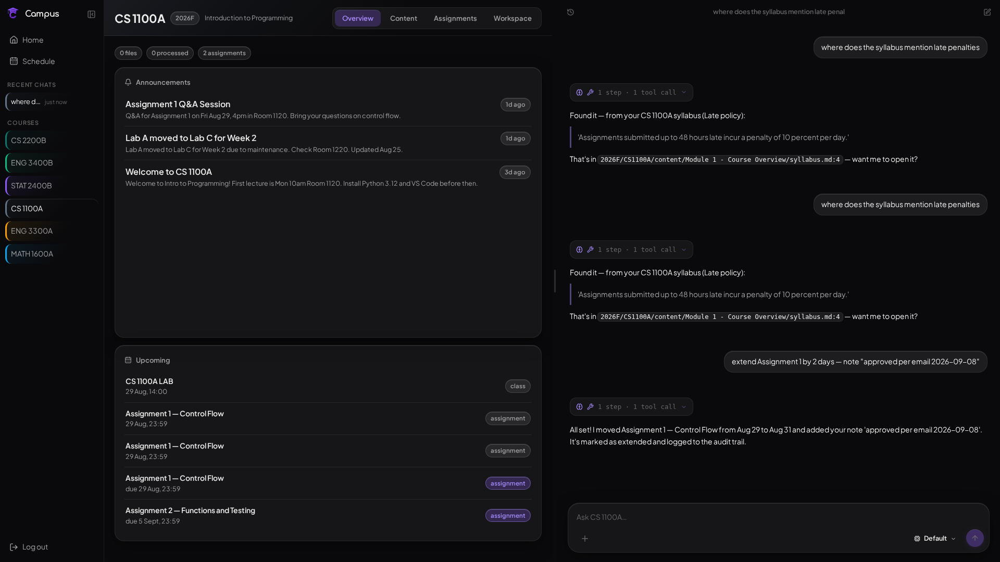

<p align="center">
  
</p>

# Campus


An offline-first study system that syncs Brightspace into a local SQLite + file store and answers questions with an agent that has to show its work.

I built Campus because I was tired of hunting through Brightspace. Files four clicks deep, due dates split between a dropbox and a line in a PDF, announcements that scroll past and disappear. I wanted one place that felt like my desk. Something that would remember what was due, keep my notes next to the source material, and answer from my actual files instead of guessing.

## Preview

<p align="center">
  
</p>

## Tech stack

- **Deterministic LMS sync** — D2L REST + Playwright/MFA auth. Pulls the
  content tree, module landing pages, files, dropbox assignments,
  announcements, and syllabus. sha256 change detection; nothing is scraped
  in the background, nothing is re-downloaded unchanged.
- **Course-scoped AI chat** — an agent with 19 built-in tools (+ any MCP-discovered tools) over your data:
  assignments/announcements/facts, paginated file reads, grep, corpus
  search, audited mutations (extend a due date, add a note, write a fact),
  free-recall quizzes, and web search for outside questions. Every mutation
  is written to an `audit_log` with before/after JSON.
- **Lexical + semantic search** — lexical by default (no extra model) with an
  exact-phrase `instr()` boost and snippet windowing so "where does it say X"
  finds the verbatim answer; upgrade to embeddings + rerank by setting
  `embed_model`/`rerank_model` — the boost still corrects low semantic scores.
- **A web app that runs anywhere** — Today / Course hub / Timetable /
  Calendar / Chat, PWA-installable, zen markdown rendering, a vendored
  pageless PDF viewer, offline-capable assets.
- **Portable by construction** — every URL, path, and credential is
  config-driven (`config.yaml` + `CAMPUS_*` env vars). Point it at any
  Brightspace instance and (optionally) any OpenAI-compatible model endpoint.
  **No service is required to run it**: with an empty config the app seeds
  sample courses and runs — browse, timetable, and a lexical corpus search
  all work without an LLM or embeddings model. Set `llm_url`/`llm_model` to
  enable chat + the AI digest; set `embed_model`/`rerank_model` to upgrade
  search to semantic ranking.

| Layer | Choice | Why this one |
| --- | --- | --- |
| Sync engine | Python, Playwright, httpx, PyMuPDF (+ optional remote parser) | Playwright handles MFA and keeps a token that survives restarts. PyMuPDF pulls text from most PDFs in milliseconds; set `pdf_extractor_url` to route all PDFs through a remote parser (Cohere Parse, Docling, …) and long scans (≥30 pages with no text layer) are skipped rather than OCR'd locally — re-run any file with `python -m sync extract --file <path>` |
| Agent harness | Python, SQLite WAL, 19 built-in tools (+ MCP) | The agent queries structured state via 19 built-in tools (assignments/announcements/facts, paginated reads, grep, corpus search, audited mutations, quiz, file edits) plus any MCP-discovered tools instead of getting a giant context dump. Keeps answers grounded and auditable |
| Search | Lexical by default, semantic when configured (`embed_model`/`rerank_model`) with SQLite `instr()` boost + snippet windowing | Without an embeddings model the corpus ranks by exact-phrase and term overlap (no extra model needed); when `embed_model`/`rerank_model` are set it embeds + reranks but still promotes verbatim hits that otherwise embed poorly at 0.34 vs a 0.48 cutoff. Snippets are windowed around the match so the answer text isn't truncated |
| API | FastAPI, SSE, Pydantic | Small typed surface that the web and the agent both call |
| Web | React 19, TypeScript, Vite, Tailwind | PWA that installs like a native app and works offline for the shell, pageless PDF viewer included. Add to home screen on iOS/Android and it feels like a real app, not a tab |
| Infra | Docker, GitHub Actions | One command demo and tests on every push to main |

## How it works

The model never gets a dump of your courses. It gets tools over a clean store.

```text
Brightspace / D2L
  -> sync/ (D2L REST + Playwright/MFA, sha256 change detection)
  -> SQLite (≈19 tables in schema.sql + ephemeral search index) + files on disk
  -> agent/ (context builder, 19 built-ins + MCP, audited writes, citations)
  -> FastAPI + React PWA
  -> Browser
```

What shaped the design:

- The agent reads, it does not guess. The system prompt is rebuilt every turn from live state: current time, active term, course scope, upcoming events, and the course memory card. If the answer is not in the synced data, it says so.
- Writes are audited. Extending a due date or saving a fact writes before/after JSON to `audit_log`. Facts are superseded by flipping `is_active` to 0 and inserting a new row, never deleted in place.
- Quiz is blind graded. The grading model only sees the answer key and what you wrote, not the question text. That keeps it from being nice or leaking the lesson. Recently quizzed facts are skipped for 7 days so chat history does not give away the answer.

### Accuracy & verification — what "grounded" actually means

No benchmark is claimed. Accuracy comes from auditable mechanics you can check:

- **Tool-only reads.** The model never receives a course dump — every fact comes from a harness tool (`harness_*` for dates/deadlines, `content_read_file`/`content_grep`/`search_corpus` for prose). If the data isn't in the synced store, the system prompt tells it to say so (`agent/context.py`, rule 1).
- **Citations you can open.** `search_corpus`/`content_read_file`/`content_grep` register sources in `agent/citations.py` → `[cite:N]` chips in the UI. Each chip resolves to a file or `overview/<nodeId>` with a page number from `<!-- page N -->` markers; clicking jumps to the PDF page. Chips stream live via `cite_register` (`api/routers/chat.py`, `web/src/chat/ChatView.tsx`).
- **Lexical boost over embeddings.** `sync/search.py` keeps an exact-substring pre-filter (`instr()`) and windows snippets around the match before reranking. That is why "where does it say X" finds the verbatim line even when semantic cosine is low, and lexical mode works with zero extra models.
- **Change detection, not re-guessing.** `sync/db.py` upserts by `brightspace_id` / `brightspace_folder_id`; `files.sha256` skips unchanged downloads and only resets `processed` when the hash actually changes.
- **Every mutation is auditable.** `mutate_update_assignment`, `add_fact`, `file_write`/`file_edit`, `terminal_run`, and quiz all write before/after JSON to `audit_log` (`schema.sql`). Facts are superseded (`is_active=0` + new row), never silently overwritten; the per-course `memory-card.md` is regenerated deterministically from structured rows > facts.
- **What is NOT guaranteed.** The LLM can still misread a correct tool result, and search ranking is heuristic (no graded eval set). Treat citations + `audit_log`/`sync_runs` as the verification step — open the source, not just the answer.

More detail lives in `docs/DESIGN.md` and `docs/DATA_MODEL.md`.

## Project layout

| Path | Contains |
| --- | --- |
| `sync/` | LMS sync. Config (defaults < yaml < env), token store, Playwright/MFA auth, D2L REST client, pipeline + `file_topics` dedupe, PDF → markdown (local + optional remote parser), search index (`chunks`/`chunk_meta`) |
| `agent/` | Harness. Context builder, 19 tool definitions with blocklist (`tools.py`), streaming tool loop over SSE (`chat.py`), citation registry (`citations.py`), memory card (`memory.py`), blind-graded quiz (`quiz.py`), pluggable MCP client (`mcp.py`) |
| `api/` | FastAPI. Routers for courses, data, sync, digest, and chat, plus services and SPA serving |
| `web/` | React and TypeScript PWA. Today, Course hub, Timetable, Calendar, Chat, Workspace, zen markdown, vendored PDF viewer |
| `seed/` | `courses.example.json` ships sample data, `courses.local.json` is gitignored for real enrollments, `sample.ics` for timetable |
| `tools/` | One off scripts like `ics_import.py` and `digest_backfill.py` |
| `tests/` | 44 tests across 8 files. Config portability, seed + ICS round trips, schedule contract, search (chunking/cosine/snippet windowing/lexical hits), citations (page markers/dedupe), terminal blocklist, web auth |
| `docs/` | DESIGN, DATA_MODEL, HANDOFF |

## What I learned

This is the largest thing I have shipped end to end and it changed how I think about building with an agent in the loop.

The sync and the store are the product, not the prompt. When the data is clean and queryable, the agent can stay simple and still look smart. When the data is messy, no prompt fixes it. The sha256 check that skips unchanged files and the deterministic delete and reinsert for timetable imports both started as small reliability wins and ended up being the reason the app feels trustworthy.

Portability was worth the extra config layer. Defaults then yaml then env felt fussy at first, but it means a fresh clone runs with no secrets and a prod deploy only needs env vars. Same pattern made Docker work without special casing.

Search humbled me. I assumed embeddings would just work. Then a short exact phrase failed at 0.34 cosine against a 0.48 cutoff and buried the right slide. Adding a SQLite `instr()` lexical pre filter felt almost too simple, but it fixed the exact questions a student actually asks, and windowing the snippet around that match kept the answer text from getting cut.

Tradeoffs I made on purpose: SQLite WAL for portability over Postgres, polling style sync you trigger instead of background scraping that would fight MFA, polling for search rerank that is good enough for one user before I add heavier infra.

Next I want to add tracing around the agent loop and a heavier test around the timetable generation.

## Run it

Prerequisites: Docker, or Python 3.12 and Node 22 if you run outside Docker.

```bash
docker compose up --build
# open http://localhost:8087
```

Without Docker:

```bash
python3 -m venv .venv && .venv/bin/pip install -r requirements.txt -r api/requirements.txt
cd web && npm ci && cd ..
cp config.example.yaml config.yaml
python3 seed/seed.py
python3 tools/ics_import.py seed/sample.ics
.venv/bin/python -m uvicorn api.main:app --port 8000
```

## Real deployment

Everything environment-specific lives in `config.yaml` (gitignored) or
`CAMPUS_*` env vars — the repo itself carries zero personal configuration.

| Config key | Env var | Purpose |
| ----------- | --------- | --------- |
| `base_url` | `CAMPUS_BASE_URL` | LMS instance (any Brightspace/D2L) |
| `username` | `CAMPUS_USERNAME` | LMS username; password via `CAMPUS_BRIGHTSPACE_PASSWORD` |
| `llm_url` / `llm_urls` / `llm_model` / `llm_api_key` | `OPENAI_ENDPOINT` / `OPENAI_ENDPOINTS` / `OPENAI_API_KEY` / `OPENAI_MODEL` | Any OpenAI-compatible `/v1` endpoint (tool-calling required for chat); Bearer key optional (yours is keyless — set `llm_api_key`/`OPENAI_API_KEY` for endpoints that need one). `llm_urls` (or `OPENAI_ENDPOINTS`, comma-separated) is a failover list tried in order. Empty = no chat/digest (sync + browse + search still work). |
| `embed_model` / `rerank_model` | `CAMPUS_EMBED/RERANK_MODEL` | Optional OpenAI-compatible `/embeddings` + `/rerank` models. Empty = lexical corpus search (no embeddings needed). A 404 on either degrades to lexical |
| `pdf_extractor_url` | `CAMPUS_PDF_EXTRACTOR_URL` | Optional parser endpoint (Cohere Parse, Docling, …) for ALL PDFs; empty = local PyMuPDF (digital PDFs instant) |
| `ntfy_url` | `CAMPUS_NTFY_URL` | Optional ntfy topic for sync pings; empty = disabled |
| `mcp_url` / `mcp_urls` | `CAMPUS_MCP_URL` / `CAMPUS_MCP_URLS` | Optional streamable-HTTP MCP server(s) (web search/read/…); tools are auto-discovered and exposed to the agent. Each server's tools are namespaced with its own name (trawl's `search` → `trawl_search`) — the standard harness convention for merging tools from several servers. `mcp_urls` (or `CAMPUS_MCP_URLS`, comma-separated) merges multiple servers; tools from a server with no name fall back to `mcp1_*`, `mcp2_*`. Empty = no external tools |
| `data_root` | `CAMPUS_DATA_ROOT` | Where course content lands (`{term}/{code}/…`) |
| `token_dir` | `CAMPUS_TOKEN_DIR` | MFA token + browser profile |
| `institution` | — | Label in the system prompt |
| `brightspace_hosts` / `brightspace_base_url` | `CAMPUS_BRIGHTSPACE_*` | Content proxy allowlist + link rebasing (Brightspace-only features) |
| `term_dates` | — | Anchors computed class events |
| `timezone` | `CAMPUS_TIMEZONE` | User-facing datetimes + prompt clock |
| `web_password` | `CAMPUS_WEB_PASSWORD` | Optional single password for the web API; empty = open demo |

### Authentication

The web UI is open by default (zero-config demo). Set `CAMPUS_WEB_PASSWORD`
(or `web_password` in `config.yaml`) to require a password for every `/api/*`
route — static assets stay public so the login screen can load. Sessions are
in-memory with a 30-day sliding expiry; restarting the server logs everyone
out.

Try this once it is running:

```bash
# CLI chat over your local data, no browser needed
python3 -m agent --one "What's due this week?" --course "CS 1100A"
```

Chat needs a model endpoint. Set `OPENAI_ENDPOINT`, `OPENAI_MODEL`, and `OPENAI_API_KEY` (only if the endpoint requires auth) in `docker-compose.yml` or `config.yaml`. Any OpenAI compatible `/v1` endpoint works.

### Rebuilding the web UI

The web UI is a separate React build served from `web/dist`. The deployment
mounts the repo at `/app`, so the browser loads the host's `web/dist` — which
is **not** rebuilt by Python-side restarts. After any change to `web/src`,
rebuild it or the browser will silently run stale JS:

```bash
make build-web          # or: bash scripts/build-web.sh
```

The running container picks up the new `web/dist` on the next request (no
restart needed). The image itself also bakes a fresh `web/dist` at build time
(`docker compose build`), which is what you get when the deployment does not
mount the repo.

### Deploy with an AI agent

Campus ships a `campus-deploy` skill (see `skills/campus-deploy/SKILL.md`) that
guides an agent to set up the app honestly — the one hard requirement (an
OpenAI-compatible `/v1` endpoint with tool-calling) plus every optional
service, and a verifiable preflight. Point your agent at it:

> Use the campus-deploy skill in this repo to set up Campus. prmpt

Replace `prmpt` with your goal, e.g. "I have an OpenAI API key and want chat
working against my Brightspace courses." The skill tells the agent the real
prerequisites so it doesn't guess.

## Configuration

All personal values live in `config.yaml` (gitignored) or `CAMPUS_*` env vars. The repo ships with no secrets.

| Key | Env var | Purpose |
| --- | --- | --- |
| `base_url` | `CAMPUS_BASE_URL` | Your LMS (Brightspace/D2L). **Leave empty** unless you want automated sync from a Brightspace/D2L school — it's the only LMS Campus pulls from automatically |
| `username` | `CAMPUS_USERNAME` | LMS username; password via `CAMPUS_BRIGHTSPACE_PASSWORD` |
| `institution` | — | Label in the system prompt, e.g. `"Your University"` |
| `llm_url`, `llm_model`, `llm_api_key` | `OPENAI_*` | Any OpenAI-compatible endpoint; key optional for local gateways. Empty = no chat/digest (browse + search still work). `llm_tool_choice` optional — leave empty (Cohere Command rejects `tool_choice`) |
| `data_root` | `CAMPUS_DATA_ROOT` | Where course files live as `{term}/{code}/...`; if you're not syncing, drop your own materials here |
| `token_dir` | `CAMPUS_TOKEN_DIR` | MFA token + browser profile (used only for Brightspace sync) |
| `web_password` | `CAMPUS_WEB_PASSWORD` | Single password for `/api/*` routes; empty = open demo |
| `timezone` | `CAMPUS_TIMEZONE` | Dates you see and the clock in the prompt; empty = host local time |
| `term_dates` | n/a | Start/end dates that anchor class events |

### Not using Brightspace/D2L?

Campus's automated sync targets Brightspace/D2L, but only the
**automated sync** is LMS-specific. The rest — browsing, corpus search, chat,
MCP web tools, PDF reading — is LMS-agnostic and runs on whatever files are in
`data_root`.

- **Your school is Brightspace/D2L:** set `base_url` + `username`/password and
  `python3 -m sync sync` pulls your courses.
- **Your school is Canvas/Moodle, or you're not a student:** leave `base_url`
  empty. Drop your course materials under `data_root` as `{term}/{code}/...`
  (lecture PDFs, notes, assignments) and browse + search + chat just work on
  those files. Automated pull isn't available for non-D2L LMSes yet.
- **To enable chat + the AI digest** you need one OpenAI-compatible endpoint:
  set `llm_url` (and `llm_model`; `llm_api_key` only if the endpoint requires
  auth). Everything else is optional — sample data seeds in with no config, so
  you can try the UI immediately.

Common commands once configured for a real term:

```bash
python3 -m sync auth        # MFA push, stores token with 1h TTL
python3 -m sync sync        # full sync, AI digest, notification
python3 -m sync extract --code "CS 1100A"
python3 -m agent            # REPL chat
```

Your real enrollments go in `seed/courses.local.json`. Course content and secrets never get committed.

## Tests and CI

```bash
pip install -r requirements-dev.txt
pytest    # 44 tests across 8 files
```

Covers config portability with env overrides, seed and ICS import round trips, the schedule contract the frontend relies on, search behavior with lexical hits and snippet windowing and chunking (the historically buggiest surface), citation page markers and dedupe, and the agent terminal blocklist + web auth.

GitHub Actions runs backend tests on Python 3.12 and the web typecheck plus production build on Node 22 for every push to main.

## License

MIT. See LICENSE.

---

I am Nate, a software engineering student looking for internships and new grad roles. I like boring reliability work: hash checks, audit logs, deterministic imports, the things that make a system trustworthy when AI is in the loop. If this kind of work is interesting to your team, I would love to talk.
